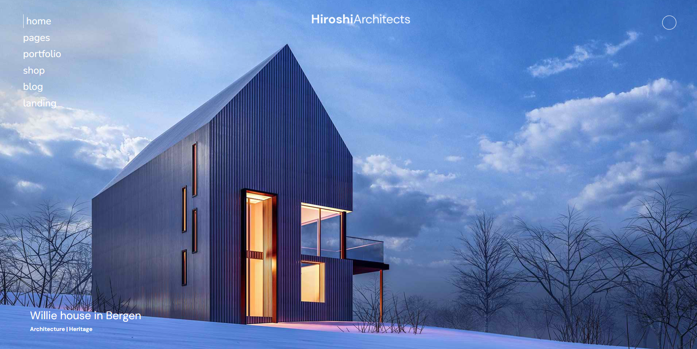

# 🏛️ Architect Studio — Modern Architecture Website

A responsive, elegant website created for a fictional **architecture & design studio**.  
The project demonstrates clean structure, minimalistic design, and a strong visual hierarchy — all built using **HTML** & **CSS**.

---

## 🌐 Live Demo

🔗 **View on GitHub Pages:** 

📁 **Source Code:** [Open Folder](./)

---

## 🧠 Overview

**Architect Studio** represents a modern digital presence for an architecture firm.  
The design focuses on minimalism, white space, and typography — reflecting the aesthetics of real architectural portfolios.

---

## ⚙️ Features

- 🧭 **Responsive design** — optimized for mobile, tablet, and desktop
- 📍 **Contact section** — embedded map and contact form
- 🌗 **Consistent color palette** — modern neutral tones and clean fonts

---

## 🧩 Tech Stack

- **HTML5** — semantic and accessible markup
- **CSS3 (Flexbox / Grid)** — responsive and adaptive layout
- **Google Fonts** — modern typography
- **GitHub Pages** — hosting and deployment

---

## 📸 Preview

---

## 📁 Project Structure

architect-studio/
│
├── index.html
├── /src
│ ├── /styles
│ │ ├── style.css
│ │ └── adaptive.css
│ ├── /scripts
│ │ └── main.js
│ └── /assets
│ ├── /foto
│ ├── /icons
│ └── preview.jpg
└── README.md
